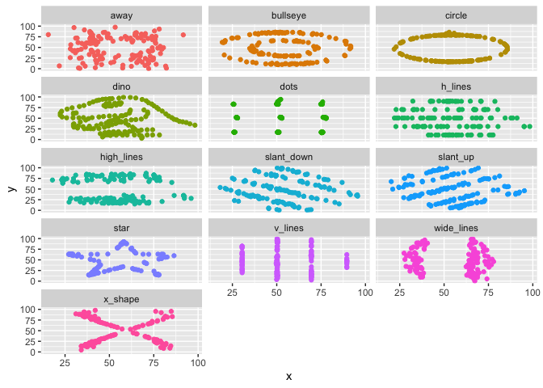

Lab 01 - Hello R
================
Jonathan Trattner
Tuesday, February 2nd, 2021

## Load packages and data

``` r
library(tidyverse) 
library(datasauRus)
```

## Exercises

### Exercise 1

Basedo n the text it has 1846 rows and 3 columns. The variables are the
dataset, indicating which dataset the data comes from, and x/y.

### Exercise 2

The answers for this Exercise are given for you below. But you should
clean up some of the narrative so that it only includes what you want to
turn in.

First let’s plot the data in the dino dataset:

``` r
datasaurus_dozen %>%
  filter(dataset == "dino") %>%
  ggplot(aes(x = x, y = y)) +
  geom_point()
```

<!-- -->

And next calculate the correlation between `x` and `y` in this dataset:

``` r
datasaurus_dozen %>%
  filter(dataset == "dino") %>%
  summarize(r = cor(x, y))
```

    ## # A tibble: 1 x 1
    ##         r
    ##     <dbl>
    ## 1 -0.0645

### Exercise 3

Add code and narrative as needed. Note that the R chunks are labelled
with `plot-star` and `cor-star` to provide spaces to place the code for
plotting and calculating the correlation coefficient. To finish, clean
up the narrative by removing these instructions.

Blah blah blah…

``` r
datasaurus_dozen %>%
  filter(dataset == "star") %>%
  ggplot(aes(x = x, y = y)) +
  geom_point()
```

<!-- -->

I’m some text, you should replace me with more meaningful text…

``` r
datasaurus_dozen %>%
  filter(dataset == "star") %>%
  summarize(r = cor(x, y))
```

    ## # A tibble: 1 x 1
    ##         r
    ##     <dbl>
    ## 1 -0.0630

### Exercise 4

Add code and narrative as needed. Note that two R chunks are given but
they are not labeled. Use the convention from above to name them
appropriately.

``` r
datasaurus_dozen %>%
  filter(dataset == "circle") %>%
  ggplot(aes(x = x, y = y)) +
  geom_point()
```

<!-- -->

``` r
datasaurus_dozen %>%
  filter(dataset == "circle") %>%
  summarize(r = cor(x, y))
```

    ## # A tibble: 1 x 1
    ##         r
    ##     <dbl>
    ## 1 -0.0683

### Exercise 5

``` r
datasaurus_dozen %>%
  ggplot(aes(x = x, y = y, color = dataset)) +
  geom_point() +
  facet_wrap(~dataset, ncol = 3) + 
  theme(legend.position = "none")
```

<!-- -->

``` r
datasaurus_dozen %>%
  group_by(dataset) %>%
  summarize(r = cor(x, y))
```

    ## # A tibble: 13 x 2
    ##    dataset          r
    ##  * <chr>        <dbl>
    ##  1 away       -0.0641
    ##  2 bullseye   -0.0686
    ##  3 circle     -0.0683
    ##  4 dino       -0.0645
    ##  5 dots       -0.0603
    ##  6 h_lines    -0.0617
    ##  7 high_lines -0.0685
    ##  8 slant_down -0.0690
    ##  9 slant_up   -0.0686
    ## 10 star       -0.0630
    ## 11 v_lines    -0.0694
    ## 12 wide_lines -0.0666
    ## 13 x_shape    -0.0656
